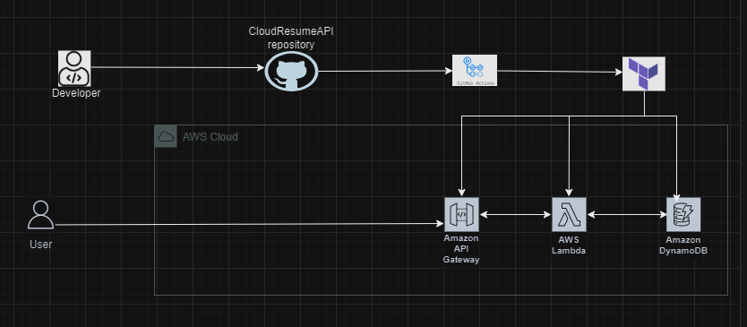
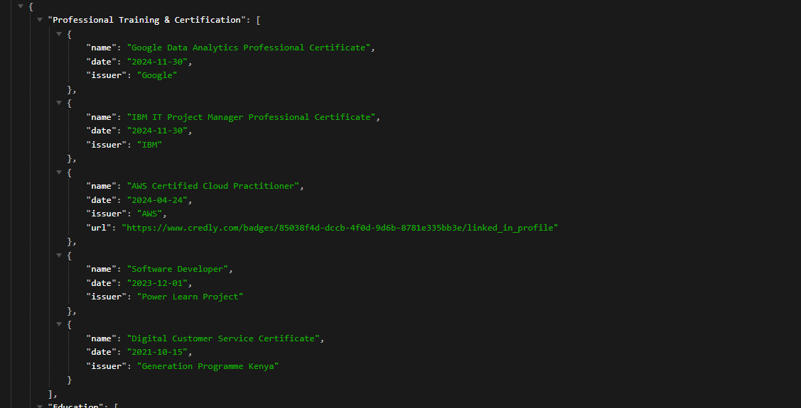

# [Cloud Resume API Challenge](https://cloudresumeapi.dev/)
_**by [Richab Kumar](https://github.com/rishabkumar7/cloud-resume-api) and [Rex Tech](https://x.com/REXTECH_/status/1810292176410308726)**_

## Overview
This is a project where a serverless Resume API is built and deployed using AWS resources. Here, an AWS Lambda function fetches resume data from an Amazon DynamoDB table, and returns it in JSON format. GitHub Actions is also integrated to auto-deploy changes to the Cloud serverless function, whenever they are pushed to the repository. 

## Architecture Diagram


## Technologies
- Amazon DynamoDB
- Amazon API Gateway
- AWS Lambda
- Terraform
- GitHub Actions 


## Prerequisites
1. Install Terraform on your local machine.
2. Configure your Terraform code to connect to the AWS.

## Usage
Switch to the directory containing the .tf files 
To run Terraform on your local machine.

Create, update and destroy AWS resources by running Terraform locally using the following commands:
```
$ terraform init
$ terraform plan
$ terraform apply
$ terraform destroy
```

## Test
```
https://d3viw2dbta.execute-api.us-east-1.amazonaws.com/dev/

```


## License
[MIT](https://opensource.org/license/mit)

_Copyright (c) 2023 **Rosemary Ojwang**_
