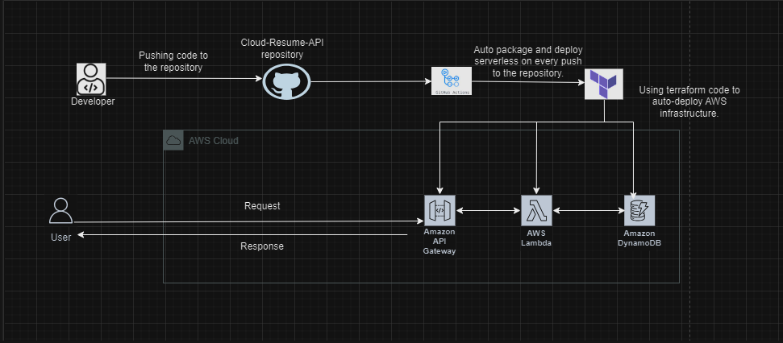

# [Cloud Resume API Challenge](https://cloudresumeapi.dev/)
_**by [Richab Kumar](https://github.com/rishabkumar7/cloud-resume-api) and [Rex Tech](https://x.com/REXTECH_/status/1810292176410308726)**_

## Overview
This is a project where a serverless Resume API is built and deployed using AWS resources. Here, an AWS Lambda function fetches resume data from an Amazon DynamoDB table, and returns it in JSON format. GitHub Actions is also integrated to automatically deploy changes to the AWS Lambda function on every push to your repository. 

## Technologies
- Amazon DynamoDB: 
    - To store the resume data in JSON format, enabling quick and efficient retrieval by our Lambda function.
- Amazon API Gateway: 
    - To provide the RESTful API endpoint that exposes our Lambda function to the internet. It handles all requests and responses to ensure our API is accessible and scalable.
- AWS Lambda: 
    - To run the code to fetch and return resume data from DynamoDB in JSON format.
- Terraform: 
    - To automate the creation and management of AWS resources- AWS Lambda, Amazon API Gateway and Amazon DynamoDB.
- GitHub Actions: 
    - To automate the deployment process, triggering workflows that deploy changes to our Lambda function whenever changes are pushed to the repository. 

## Architecture Diagram


## Prerequisites
1. Install Terraform on your local machine. Click [here](https://developer.hashicorp.com/terraform/tutorials/aws-get-started/install-cli) for a step by step guide on how to install terraform.
2. Create a GitHub repository for the project.

## Set Up Procedure

### Step 1
Create a new folder for your Cloud Resume API project and navigate into the folder using the commands below.
```
mkdir Cloud-Resume-API
cd Cloud-Resume-API
```

### Step 2
Create the terraform configuration files using the following command.
```
touch main.tf variable.tf output.tf lambda_function.py
```

### Step 3
Configure AWS credentials in your project, and define DynamoDB table, API Gateway and Lambda function in main.tf. 

### Step 4
Write the Lambda function code in lambda_function.py file (in python programming language) and package the code into a ZIP file.

- Packaging the lambda function code into a ZIP file ensures that all necessary code and libraries are included. This makes it portable and allows it to run in AWS environment as intended. 

### Step 5
Initialize and Deploy the project using the following commands in your IDE terminal:
```
terraform init
terraform plan
terraform apply
```
The output should look like this after you run the las command:


### Step 6
Push the project's code to your GitHub repository.

### Step 7
Set up GitHub Actions.
1. Create a folder .github inside the project directory and navigate into it.
```
mkdir .github
cd .github
```
2. Create another folder inside the .github folder, name it workflows and navigate into it.
```
mkdir workflows
cd workflows
```
3. Now create a file action.yml inside workflows folder.
The path should be: .github/workflows/action.yml
4. Copy and paste the following code into action.yml.
```
name: Cloud Resume API
on: push
jobs: 
  build: 
    name: Build and Deploy
    runs-on: ubuntu-latest 
    env:
      AWS_ACCESS_KEY_ID: ${{ secrets.AWS_ACCESS_KEY_ID }}
      AWS_SECRET_ACCESS_KEY: ${{ secrets.AWS_SECRET_ACCESS_KEY }}
      AWS_REGION: ${{ secrets.AWS_REGION }}   
    steps:
      - name: Checkout Code
        uses: actions/checkout@v2
      - name: Upload JSON Data to DynamoDB
        run: |
          aws dynamodb put-item \
            --table-name your_dynamodb_table_name \
            --item file://resume.json \
            --region ${{ secrets.AWS_REGION }}
```
NB: Replace 'your_dynamodb_table_name' with the name of your dynamodb table.
5. Configure GitHub secrets in your GitHub repository.
- Go to **Settings** > **Secrets and variables** > **Actions**.
- Add the following secrets:
AWS_ACCESS_KEY_ID: Your AWS Access Key ID.
AWS_SECRET_ACCESS_KEY: Your AWS Secret Access Key.
AWS_REGION: Your AWS Region. 
- Push the changes to GitHub.
6. Verify that the workflow runs and successfully deploys the project by going to the **Actions** tab in your GitHub repository.

_The green ticks are an indication of successful deployment._

## API Endpoint
Use the following endpoint to interact with the API.
```
https://d3viw2dbta.execute-api.us-east-1.amazonaws.com/dev/

```


## License
[MIT](https://opensource.org/license/mit)

_Copyright (c) 2023 **Rosemary Ojwang**_
